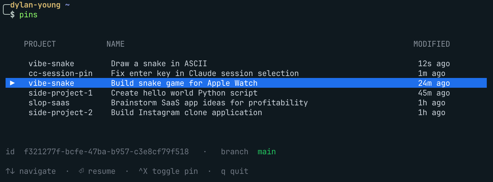

# cc-session-pin

Pin and resume Claude Code and Cursor agent sessions across project directories.

Both tools scope their own resume picker to the current working directory: `claude -r` reads `~/.claude/projects`, and `agent --resume` reads the chats bucketed under your workspace path. `cc-session-pin` lets you mark sessions from either tool as "pinned" and browse / resume them from anywhere, with a small TUI and a sessionId-prefix resolver.



## Features

- Pin the latest session in the current project, from either tool, or any session by id prefix
- One list across both tools, with a `SRC` column showing which one owns each row (`cc` / `cr`)
- Interactive TUI list with branch + last-modified info, stale-session marking, and `^X` to toggle pin state
- Resume a pinned session by id prefix or name substring
- Optional shell integration that cds your parent shell into the project directory on resume — so split panes, new tabs, and dev servers spawn in the right place
- Skills for pinning / unpinning the current session from inside Claude Code

## Install

Requires [Bun](https://bun.sh) and [pnpm](https://pnpm.io). You also need whichever agents you want to pin on your PATH: `claude` for Claude Code, `agent` for Cursor. Neither is mandatory, and sessions for a missing tool are simply never listed.

```sh
git clone https://github.com/dylanyoung-dev/cc-session-pin.git
cd cc-session-pin
pnpm install
pnpm link --global
```

This installs six bins on your PATH:

| Short form | Long form  | Action                          |
| ---------- | ---------- | ------------------------------- |
| `pin`      | `cc-pin`   | Pin / umbrella CLI              |
| `pins`     | `cc-pins`  | Open the pinned-sessions TUI    |
| `unpin`    | `cc-unpin` | Unpin by token or by cwd        |

The `cc-` prefixed names are there for collision-free use if `pin` / `pins` / `unpin` clash with something else on your system.

### Optional Shell integration (recommended)

The shell wrapper makes `pins → Enter` (resume) drop your parent shell into the project directory, so any new pane / tab you open during the Claude session starts in the right place.

Add **one** line to your shell config:

```sh
# zsh / bash (in ~/.zshrc or ~/.bashrc)
eval "$(cc-pin shell-init)"

# fish (in ~/.config/fish/config.fish)
cc-pin shell-init fish | source
```

Then reload (`source ~/.zshrc` or open a new tab). Without it, the binaries still work; the cd-on-resume just won't trigger.

## Commands

| Command                               | What it does                                                        |
| ------------------------------------- | ------------------------------------------------------------------- |
| `pin`                                 | Pin the most recently modified session in the current directory     |
| `pin <sessionId>`                     | Pin a specific session by id (full or unique prefix)                |
| `pin -n "..."` / `pin --name "..."`   | Pin and override the auto-derived display name (sticks through re-pins)              |
| `pin --sync-name`                     | Drop a custom name and follow the agent's own title again                            |
| `pins`                                | Open the interactive TUI (`↑↓` navigate, `⏎` resume, `^X` toggle, `^R` rename, `/` filter, `q` quit) |
| `pins <filter>`                       | Open the TUI prefiltered to pins whose project path contains `<filter>` (case-insensitive) |
| `pins <filter> -N`                    | Same, but match the chat name instead of the project path (`--by-name`, or `--by project\|name`) |
| `pins --plain`                        | Print a plain table for piping / scripting                          |
| `pins --all`                          | Include soft-deleted entries in the list                            |
| `unpin`                               | Soft-delete the pin matching the current directory                  |
| `unpin <token>`                       | Soft-delete a pin by id (full or prefix) or name substring          |
| `cc-pin resume <token>`               | Resume a pinned session directly (no TUI)                           |
| `cc-pin purge`                        | Permanently drop all soft-deleted entries                           |
| `cc-pin shell-init [zsh\|bash\|fish]` | Print the shell wrapper (see [Shell integration](#shell-integration-recommended)) |

`<token>` matches a pin by **session id** (full or any unique prefix) or by **name substring** — whichever uniquely identifies one pin.

### Notes

- **Pinning:** display names come from the agent's own title, so they match what `claude -r` and Cursor's picker show. Rename a chat inside either tool and `pins` picks it up on the next listing. Override the name with `-n` / `--name` and it sticks through re-pins, until you pass `--sync-name` to follow the agent's title again.
- **Providers:** `pin` with no argument looks at both tools and takes whichever session in the directory was touched most recently. Resume runs `claude -r <id>` or `agent --resume=<id>` from the pin's project directory.
- **TUI:** `^X` stages a pin/unpin toggle on the highlighted row; changes apply when you quit. Soft-deleted entries hide from `pins` but still show in `pins --all`, where you can re-pin them with `^X`. Press `^R` to rename the highlighted row inline (`⏎` saves, `esc` cancels). Press `/` to filter rows live; `⏎` exits filter-edit mode and keeps the filter, `esc` clears it. Press `⇥` to switch what the filter matches — project path or chat name — which re-filters in place, so you can find a chat by name when you don't remember its project. The active scope is shown in the hint line (`filter project:` / `filter name:`), and `-N` / `--by name` sets the starting scope.
- **Skills:** inside Claude Code, the bundled `pin` / `unpin` skills (see [Skills](#skills)) wrap the same commands so you can pin without leaving the chat.

## Skills

The repo ships two Claude Code skills under `skills/`:

- `pin` — pins the current session (`cc-pin add ${CLAUDE_SESSION_ID}`)
- `unpin` — unpins the current session (`cc-pin rm ${CLAUDE_SESSION_ID}`)

To use them, point your Claude Code skills directory at this repo's `skills/` folder.

## Storage

State lives at `~/.claude/pinned-sessions/pins.json`. It's a small, human-readable JSON file, safe to delete to start fresh. Entries written before multi-provider support gain their `provider` and `nameSource` fields the next time the file is saved.

## Development

```sh
pnpm typecheck       # tsc --noEmit
bun src/cli.ts ...   # run the CLI directly without reinstalling
```

After a `pnpm link --global`, edits to source files are picked up immediately — no reinstall needed.

## License

MIT
